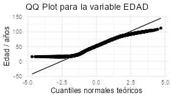
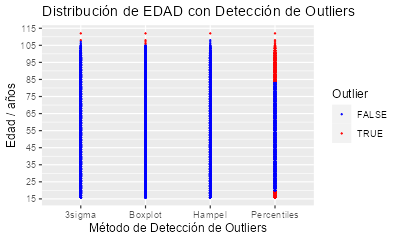
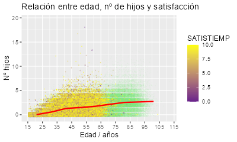

# Introducción.

El conjunto de datos que se utiliza para el análisis pertenece al Instituto Nacional de Estadística (INE). En concreto, pertenece a una encuesta realizada a la población en el año 2021 que tiene como propósito el proporcionar información detallada sobre personas, viviendas y edificios que no puede obtenerse a través de registros administrativos. En nuestro caso, hemos decidido hacer la exploración en su mayoría de la parte relacionada a cuestiones que se les hizo a adultos (personas de 16 años o más). Para agregar más variables de interés se escogieron algunas de otro conjunto de datos, también de esta encuesta, hecho a todos los integrantes de la vivienda y no solo a adultos. El enlace a los ficheros de microdatos se encuentra disponible [aquí](https://www.ine.es/dyngs/INEbase/es/operacion.htm?c=Estadistica_C&cid=1254736177092&menu=resultados&idp=1254735572981#!tabs-1254736195790). $\\$

*Nota importante*: Algunas gráficas se verán con relativamente mala calidad en este archivo *.PDF* ya que, debido a que tenemos un gran número de puntos en algunos gráficos, no fue posible la incorporación de los gráficos a nivel vectorial (ocupan demasiada memoria RAM en la visualización en PDF). Es por ello que se tuvo que hacer un `ggsave()` y guardar a *.png* y luego incrustarlo con un `includegraphics()`. Para una mejor visualización de dichos gráficos es mejor acudir a la carpeta *./figure* del directorio, donde habrá una versión en *HD* para ellas.

## Carga de librerías y datos necesarios para el análisis

```{r setup, cache = F, echo = F, message = F, warning = F, tidy = F}
# Configuración general de chunks
library(knitr)
options(width = 100)
knitr::opts_chunk$set(echo = F, message = F, error = F, warning = F, comment = NA, tidy = F, cache.path = '.cache/', fig.path = './figure/', include = F, fig.width = 5.0, fig.height = 4, fig.align = "left")
```

Primeramente, se cargan todas las librerías necesarias en las diferentes fases del proyecto. Esto se hace de manera más elegante utilizando el paquete `pacman` de nuestro lenguaje de programación, R.

```{r librerias, message = F, include = T, echo = F}
# Carga de librerías necesarias con pacman
library(pacman)
pacman::p_load(readr, stringr, tidyr, dplyr, readxl, ggplot2, forcats, haven, kableExtra, VIM, e1071, ggstatsplot, gridExtra, reshape2, editrules, mice, colorspace, leaflet, ggmap, ggmosaic, magick, GGally, vcd, GoodmanKruskal)
```

A continuación, se realiza la carga del conjunto de datos, presente tanto en *.txt* como *.csv* en la carpeta *./data* incluida en el repositorio del proyecto. Asimismo, se carga el fichero *.xlsx* que nos muestra el diseño de registro y valores válidos de las variables. Este fichero será especialmente útil, puesto que permitirá una automatización para convertir el conjunto de datos, que actualmente se encuentra en estado *Raw data* a *Technically correct data*, teniendo cada variable su tipo correspondiente.

```{r extraccion_dataset_csv}
# Carga del dataset haciendo uso de un formato estructurado
ruta_csv <- "data/ECEPOVadultos_2021.csv"
df_1 <- read_delim("data/ECEPOVadultos_2021.csv", 
    delim = "\t", escape_double = FALSE, 
    col_types = cols(ESTUDIOS = col_double(), 
        CAMPO = col_double()), trim_ws = TRUE)
```

```{r lectura_dataset_readLines, eval = FALSE}
# Carga del dataset como si fuera un archivo sin formato
ruta_txt <- "./data/md_ECEPOVadultos_2021.txt"
lines <- readLines(ruta_txt)

# Función para sacar las subcadenas en cada línea del .txt

extract_substrings <- function(line, start_position, length) {
  substrings <- character(length(start_position))
  
  for (i in seq_along(start_position)) {
    start <- start_position[i]
    end <- start + length[i] - 1
    substrings[i] <- substr(line, start, end)
  }
  
  return(substrings)
}

# Guardaremos las substrings en una matriz por eficiencia computacional

num_lines <- length(lines)
num_variables <- length(excel_info_1$Variable)
substring_matrix <- matrix("", nrow = num_lines, ncol = num_variables)

# Extraer las subcadenas para todas las líneas y guardarlas en las filas de la matriz

for (i in 1:num_lines) {
  substring_matrix[i, ] <- extract_substrings(lines[i], excel_info_1$Posición, excel_info_1$Longitud)
}

# Conversión al dataframe desde la matriz

df_1 <- as.data.frame(substring_matrix)
colnames(df_1) <- excel_info_1$Variable

```


```{r lectura_diseno}
# Archivos para la automatización
ruta_excel <- "data/dr_ECEPOVadultos_2021.xlsx"
excel_info_1 <- read_excel(ruta_excel, sheet = "Diseño", range = "A2:H50", col_names = TRUE)

# Almacenamiento de distintas hojas del excel para optimizar el código
Tablas1 <- read_excel(ruta_excel, sheet = "Tablas1", range = "A4:C63", col_names = TRUE)
Tablas2 <- read_excel(ruta_excel, sheet = "Tablas2", range = "A4:C112", col_names = TRUE)
Tablas3 <- read_excel(ruta_excel, sheet = "Tablas3", range = "A4:C48", col_names = TRUE)
```

$\\$

A pesar de que resultó de gran utilidad el fichero que ofrecía INE para la transformación de las variables a un tipo correspondiente, surgieron algunos fallos que se debieron solventar de manera manual. Determinadas variables no fueron adecuadamente codificadas por parte del INE, de tal forma que fue necesario modificar ligeramente el fichero *.xlsx*. Concretamente, algunos diccionarios de variables en los que no terminaba de estar correctamente determinado el código (lo que sería el level en un factor). El problema presentado (en algunas variables) consistía, básicamente, en que aparecía "01" en lugar de "1", valor recogido en las observaciones del dataset.

```{r conversion_dataset}
# Cambio manual por datos mal introducidos "2 " --> "2" para la posterior lectura con el diccionario

manual_change <- c("ESTUDIOS", "CAMPO", "NDESPLA", "MTRANSPOR_1", "MTRANSPOR_2")

df_1 <- df_1 %>%
  mutate(across(all_of(manual_change), ~ str_remove_all(., " ")))


# Conversión de las variables correspondientes a tipo numérico según indica INE

dic_tipo <- excel_info_1$Tipo

df_1 <- df_1 %>%
  mutate(across(which(dic_tipo == "N"), as.numeric)) %>%
  mutate()

# Transformación a factores de las variables pertinentes usando el fichero que ofrece INE

excel_dic <- excel_info_1 %>%
  filter(!is.na(`Diccionario de la variable`))

dic_vars <- excel_dic$Variable
dic_var <- excel_dic$`Diccionario de la variable`
dic_table <- excel_dic$`Diccionario ubicado en la hoja…`

## bucle donde se irán convirtiendo a factor de manera iterativa aquellas variables que nos indique el fichero del INE

for (i in seq_along(dic_vars)) {
  
  dataframe_name <- dic_table[i]  
  df_table <- get(dataframe_name) # con get conseguimos el nombre extrayendolo del string
  positions <- which(df_table == dic_var[i], arr.ind = TRUE) # obtener posición donde se encuentra la palabra del diccionario 
  
  if (length(positions) > 0) {
    
    fila_start <- positions[1]
    columna_start <- positions[2]
    
    fila_end <- min(which(is.na(df_table[(fila_start + 2):nrow(df_table), columna_start]), arr.ind = TRUE)[1]) + fila_start

    levels <- df_table[(fila_start + 2):fila_end, columna_start]
    labels <- df_table[(fila_start + 2):fila_end, columna_start + 1]
    
    # conversión a tipo vector para aplicar debajo factor()
    levels <- unlist(levels[[1]])
    labels <- unlist(labels[[1]])
  }
  
  df_1 <- df_1 %>%
      mutate_at(vars(dic_vars[i]), ~factor(., levels = levels, labels = labels)) 
}
```

$\\$

Una vez hecha la conversión del dataset que contaba con un mayor número de variables se decidió que era de especial interés hacer una unión con el otro dataset mencionado al inicio, con el fin de obtener variables interesantes como  `SEXO` o `EDAD`.

```{r seleccion_columnas}
columnas_a_leer <- c("IDEN", "NPV", "FACTOR", "SEXO", "EDAD", "NACIM", "PNACIM")
df_2 <- read_dta("./data/ECEPOVhogar_2021.dta", col_select = columnas_a_leer)
```

Las variables `EDAD`, `SEXO`, `NACIM` y `PNACIM` de este nuevo dataset deben ser convertidas a sus tipos correspondientes, por lo que se hace uso de la información que proporciona el INE sobre dichas variables, de manera similar a como se hizo anteriormente.

```{r lectura_diseno_2}
ruta_excel_2 <- "./data/dr_ECEPOVhogar_2021.xlsx"
excel_info_2 <- read_excel(ruta_excel_2, sheet = "Diseño", range = "A2:H162", col_names = TRUE)

# Cogemos los diccionarios manualmente puesto que solo tenemos 3 variables y el proceso es más eficiente en lectura

T_SEXO <- read_excel(ruta_excel_2, sheet = "Tablas2", range = "A6:B8", col_names = TRUE)
T_NACIM <- read_excel(ruta_excel_2, sheet = "Tablas2", range = "A26:B28", col_names = TRUE)
T_PAIS <- read_excel(ruta_excel_2, sheet = "Tablas1", range = "A74:B276", col_names = TRUE)
```

```{r conversion_dataset_2}
df_2 <- df_2 %>%
  mutate(SEXO = factor(SEXO, levels = T_SEXO$Código, labels = T_SEXO$Descripción)) %>%
  mutate(NACIM = factor(NACIM, levels = T_NACIM$Código, labels = T_NACIM$Descripción)) %>%
  mutate(PNACIM = factor(PNACIM, levels = T_PAIS$Código, labels = T_PAIS$Descripción))
```

Para lograr la unión de ambos datasets, se emplea la función `left_join` del paquete `dplyr` utilizando las variables de identificación `IDEN`, `NPV` y `FACTOR`, de tal manera que podamos establecer una relación unívoca entre los adultos presentes en el primer y segundo dataset.

```{r union_datasets}
# sin dplyr: df_merged <- merge(df_1, df_2[, c("IDEN", "NPV", "FACTOR", "EDAD", "SEXO", "NACIM", "PNACIM")], by = c("IDEN", "NPV", "FACTOR"), all.x = TRUE)
df_merged <- left_join(df_1, df_2[, c("IDEN", "NPV", "FACTOR", "EDAD", "SEXO", "NACIM", "PNACIM")], by = c("IDEN", "NPV", "FACTOR"))
```

## Características generales de los datos

Es posible hacerse una idea rápida de cuáles son los datos pertenecientes al dataframe, *df_merged*, haciendo uso de la función *glimpse*, perteneciente a la librería `dplyr`.

```{r glimpse}
dplyr::glimpse(df_merged, width = 60)
```

$\\$

En resumen, nuestro dataset cuenta con `r nrow(df_merged)` observaciones y con `r ncol(df_merged)` variables. Muchas de estas variables no nos serán de utilidad para las preguntas que deseamos responder, por lo que convendrá deshacernos de ellas por una cuestión de comodidad y optimización
en los cálculos. Las variables están explicadas en *dr_ECEPOVadultos_2021.xlsx* y  
*dr_ECEPOVhogar_2021.xlsx*. Tras un análisis detallado, las variables que nos convienen rescatar son las mostradas en la Tabla \ref{tab:tabla_vars_usadas}.

```{r variables_usadas}
data_info <- data.frame(
  Variable = c("IDEN",
    "IDQ_PV", "TAM_MUNI", "EC", "EDADEC", "ESTUDIOS", "ANOESTUD",
    "EDADESTUD", "CAMPO", "SITLAB", "FLEXI", "LUGTRAB", "SATISTIEMP", "COMPRAINT", "HIJOS",
    "NHIJOS", "TDOMEST", "SEXO", "EDAD", "NACIM", "PNACIM"
  ),
  Descripción = c(
    "Identificador de la vivienda",
    "Código de la provincia de residencia.",
    "Tamaño del municipio.",
    "Estado civil legal.",
    "Edad de adquisición del estado civil legal.",
    "Nivel de estudios alcanzado.",
    "Año que alcanzó su mayor nivel de estudios.",
    "Edad a la que alcanzó su mayor nivel de estudios.",
    "Campo de los estudios.",
    "Situación laboral durante la última semana.",
    "¿Puede flexibilizar, adaptar o acomodar su jornada laboral?",
    "Lugar de trabajo",
    "Grado de satisfacción en el tiempo de desplazamiento al trabajo/estudio.",
    "Realización de compras por internet en el último mes.",
    "Tenencia de hijos.",
    "Número total de hijos.",
    "Grado de participación en las tareas domésticas del hogar.",
    "Sexo de la persona.",
    "Edad de la persona.",
    "Lugar de nacimiento de la persona (España u otro sitio).",
    "País de nacimiento exacto de la persona."
  )
)
```

```{r tabla_vars_usadas, fig.cap = "\\label{tab:tabla_vars_usadas}", include = TRUE}
knitr::kable(data_info, format = "latex",
             booktabs = TRUE, 
             caption = "Variables de interés para el estudio.", 
             align = 'ccc', centering = FALSE,
             table.envir = "table", position = "H")
```

```{r seleccion_variables}
var_interes <- c("IDEN", "IDQ_PV", "TAM_MUNI", "SEXO", "EDAD", "NACIM", "PNACIM", "EC", "EDADEC", "ESTUDIOS", "ANOESTUD", "EDADESTUD", "CAMPO", "SITLAB", "FLEXI", "LUGTRAB", "SATISTIEMP", "COMPRAINT", "NHIJOS", "HIJOS", "TDOMEST")
  
df <- df_merged %>%
  dplyr::select(var_interes)
```

```{r glimpse_reducido}
glimpse(df, width = 60)
```

En primer lugar, ahora que tenemos un conjunto más reducido, podemos cerciorarnos que algunas reglas sencillas se cumplen, como que las variables de `EDAD`, `EDADEC`, `SATISTIEMP`, `ANOESTUD` estén entre intervalos numéricos coherentes. Para ello, utilizamos el paquete `editrules`, para posteriormente aplicarlo sobre nuestro dataframe reducido, **df**.

```{r reglas_vars}
E <- editfile("./data/reglasER.txt")
E

# También puede hacerse con if, pero esto es más elegante
```

```{r violated_rules}
ve <- violatedEdits(E, df)
summary(ve)
```

Tras aplicar estas reglas a nuestro conjunto de datos, obtenemos que no hay ninguna violación de estas (obtenemos un NULL tras usar la función `violatedEdits` sobre nuestro dataframe), por lo que no será necesario hacer una imputación o eliminado de dichas observaciones.

## Análisis de missing data en nuestro conjunto de interés

Una representación precisa de cómo se distribuyen los *missing values* por nuestro conjunto de datos lo otorga la librería `VIM` con la función `aggr()`. Se han representado solamente aquellas variables que cuentan con algún NA para facilitar la visualización. En la Figura \ref{fig:missing_values} puede observarse tanto la proporción total de valores faltantes en dichas variables individualmente (izquierda), como una serie de combinaciones posibles entre ellas de valores faltantes. 

Así, encontramos por ejemplo que la combinación de NA en (`SATISTIEMP`, `FLEXI`, `ANOESTUD`, `EDADESTUD`, `CAMPO`, `LUGTRAB`) cuenta con una proporción del 25 % de los datos totales.

```{r missing_values, include = T, fig.width = 5.9, fig.height = 5, fig.align = "left", fig.cap = "Esquema de valores missing en nuestro dataset\\label{fig:missing_values}", fig.pos = "H"}
aggr_result <- capture.output({
  df %>%
    select_if(~ anyNA(.)) %>%
    aggr(prop = TRUE, numbers = TRUE, sortVars = TRUE, combined = FALSE, sortCombs = TRUE, cex.axis = 0.6, cex.lab = 0.7, digits = 1, gap = 0, cex.numbers = 0.6, plot = TRUE, ylabs = c("Proporción de missings", ""))
})

# Mostrar solo el plot sin el data.frame para el Rmd
invisible(aggr_result)
```

Podemos observar en el gráfico de barras de la izquierda que hay proporciones de missings que parecen repetirse. Esto nos da pie a plantearnos si acaso existe una razón tras ellos más allá de la pura aleatoriedad (*missing completely at random*). Quizás existen variables observadas en nuestro conjunto de datos que según tengan un valor u otro inducen un *NA* en otras variables...

Esta cuestión puede hacerse frente utilizando la información adicional que INE nos proporciona para la base de datos. En este caso, haremos uso del [cuestionario](https://www.ine.es/metodologia/cuestionario_ECEPOV.pdf) dado. Se llega a las siguientes conclusiones:


- Si la variable `EC` (*Estado civil*) es "Soltero/a" $\Rightarrow$ la variable `EDADEC` debe contener un *NA*.

- Si la variable `ESTUDIOS` es una de estas: "No sabe leer o escribir", "Sabe leer y escribir pero fue menos de 5 años a la escuela", "Educación primaria completa o fue a la escuela al menos 5 años", "Primera etapa de educación secundaria y similar (EGB, Bachiller elemental, ESO, certificado de Estudios Primarios, certificado de Escolaridad o certificado de Profesionalidad niveles 1 o 2)" $\Rightarrow$ las variables `ANOESTUD`, `EDADESTUD` y `CAMPO` deben contener un *NA*.

- Si la variable `SITLAB` (*Situación laboral actual*) es **distinta** de "Ocupado/a" (a tiempo completo o a tiempo parcial) $\Rightarrow$ la variable `FLEXI` (*Flexibilidad en el horario de trabajo*) se pone como *NA*, automáticamente.

- Por otra parte, de manera relacionada a la anterior, la variable `SATISTIEMP` puede aparecer con un valor distinto de *NA* solo si la categoría de `SITLAB` es "Ocupado/a" (a tiempo completo o a tiempo parcial) o "Estudiante" **Y** además la variable `LUGTRAB` es distinta de "En el propio domicilio" o "En varios municipios (soy comercial, repartidor, taxista...)". 

- La variable `NHIJOS` (*número de hijos*) se pone como *NA* si y solo si la variable booleana `HIJOS` (¿ha tenido hijos?) está en "No".

**Nota**: es importante recalcar que en el propio cuestionario se pedía que a las personas encuestadas que estuvieran *teletrabajando* debido al COVID-19 respondieran teniendo en cuenta su situación anterior. $\\$

Esta serie de conclusiones de pertenencia de NA o no se comprueban en el código presente en el *.Rmd* del directorio. $\\$  


```{r verify_missing}
verif_EC <- sum(df$EC == "Soltero/a" & !is.na(df$EDADEC)) == 0 & sum((is.na(df$EDADEC) & df$EC != "Soltero/a")) == 0


vec <- c(
    "No sabe leer o escribir",
    "Sabe leer y escribir pero fue menos de 5 años a la escuela",
    "Educación primaria completa o fue a la escuela al menos 5 años",
    "Primera etapa de educación secundaria y similar (EGB, Bachiller elemental, ESO, certificado de Estudios Primarios, certificado de Escolaridad o certificado de Profesionalidad niveles 1 o 2)"
  )

verif_ESTUD <- sum(
  df$ESTUDIOS %in% vec & (!is.na(df$ANOESTUD) | !is.na(df$EDADESTUD) | !is.na(df$CAMPO))) == 0 & sum(
  !df$ESTUDIOS %in% vec & (is.na(df$ANOESTUD) | is.na(df$EDADESTUD) | is.na(df$CAMPO))) == 0


# más simple  -> ver si son iguales las sumas (no estrictamente correcto, pero sí muy probable.)

#all(sum(df$ESTUDIOS %in% vec) == sum(is.na(df$ANOESTUD)) && sum(df$ESTUDIOS %in% vec) == sum(is.na(df$EDADESTUD)) && sum(df$ESTUDIOS %in% vec) == sum(is.na(df$CAMPO)))

vec <- c("Ocupado/a - A tiempo completo", "Ocupado/a - A tiempo parcial")

verif_SITLAB <- sum(!df$SITLAB %in% vec) == sum(is.na(df$FLEXI))


vec <- c("Ocupado/a - A tiempo completo", "Ocupado/a - A tiempo parcial", "Estudiante")
vec2 <- c("En el propio domicilio", "En varios municipios (soy comercial, repartidor, taxista…)")

verif_SATISTIEMP <- sum(!df$SITLAB %in% vec & !df$LUGTRAB %in% vec2) + sum(df$SITLAB %in% vec & df$LUGTRAB %in% vec2) == sum(is.na(df$SATISTIEMP))

verif_HIJOS <- sum(df$HIJOS == "No") == sum(is.na(df$NHIJOS) | df$NHIJOS == 0) # añadido lo de NHIJOS == 0 para que cuando se modifique df siga funcionando (ver siguiente chunk)
```

```{r verify_conditions, message = TRUE, include = TRUE}
if (all(verif_EC, verif_ESTUD, verif_SITLAB, verif_SATISTIEMP, verif_HIJOS)) {
  print("Todas las condiciones se satisfacen, tal y como menciona el INE.")
} else {
  print("Alguna condición no se ha satisfecho.")
}

# Todas se satisfacen. Si sale que no es porque df se ha visto modificado.
```

Habiéndose cumplido lo que prometía el INE podemos asegurar que en nuestro conjunto de datos (al menos en nuestras variables seleccionadas de interés) no hay ningún ningún valor que se haya perdido estrictamente. Todos los NA responden a que determinadas variables (presentes en el dataset) toman un valor u otro (*missing at random*). $\\$

En nuestro análisis, hemos decidido que los únicos valores NA que pueden cobrar sentido y ser imputados son los de la variable `NHIJOS`, ya que consideramos que con 16 años (edad mínima en nuestro conjunto de datos) este valor no tendría por qué ser siempre 0. Esto permitirá que el mínimo de `NHIJOS` sea 0, y no 1. $\\$

```{r imputacion_NHIJOS}
# Codificamos los NA de la variable NHIJOS como 0, ya que nos será útil más tarde esta interpretación
df <- df %>%
  mutate(NHIJOS = ifelse(is.na(NHIJOS), 0, NHIJOS))
```

Tras hacer este cambio, tenemos datos consistentes pudiendo así empezar a extraer conocimiento sobre nuestro conjunto de datos. $\\$

En primer lugar, mediante la función *summary*, obtenemos información acerca de las características de cada variable del dataset. Para las categóricas (factor) encontramos las frecuencias de los distintos niveles, mientras que para las numéricas se indica el mínimo, máximo y mediana, entre otras cosas.

```{r summary}
summary(df)
```

```{comment, explicacion_sumario}
Podemos directamente de aquí observar cómo la mayoría de observaciones provienen de Madrid (lo cual era esperable). Hay otras cosas interesantes, como que el nivel mayoritario en la variable SITLAB sea "Ocupado/a - A tiempo completo".
```

Ya que la función *summary* devuelve demasiada información como para introducirse en este .PDF, hemos realizado una modificación de esta, incluyéndose en la Tabla \ref{tab:kable_sumario}.

```{r funcion_sumario}
SumarioDatos <- function(data = data, digitos = 3, max_topLevel_length = 47) {
  type <- sapply(data, class)
  levels <- sapply(data, function(x) { length(unique(x)) })
  topLevel <- sapply(data, function(x) {
    t <- table(x)
    colnames(t(which.max(t)))
  })

  # Añadir puntos suspensivos si supera cierta longitud (para que quepa en la hoja)
  topLevel <- ifelse(nchar(topLevel) > max_topLevel_length, paste0(substr(topLevel, 1, max_topLevel_length - 3), "..."), topLevel)

  topCount <- sapply(data, function(x) { max(table(x)) })
  topFrac <- sapply(data, function(x, digitos) {
    t <- table(x)
    (max(t) / sum(t))
  }) %>% round(digits = digitos)

  missFrac <- sapply(data, function(x) { sum(is.na(x) == TRUE) / length(x) }) %>%
    round(digits = digitos)

  sumario <- data.frame(
    variable = colnames(data),
    type = type,
    levels = levels,
    topLevel = topLevel,
    topCount = topCount,
    topFrac = topFrac,
    missFrac = missFrac
  )

  rownames(sumario) <- NULL
  return(sumario)
}
```

```{r kable_sumario, fig.cap = "\\label{tab:kable_sumario}", include = TRUE}
kable_res <- knitr::kable(SumarioDatos(data = df), format = "latex",
             booktabs = TRUE, 
             caption = "Información relevante acerca de las variables de estudio.", 
             align = 'ccc', centering = FALSE,
             table.envir = "table", position = "H",
             tabular.environment = "tabularx")

kable_styling(kable_res, font_size = 7, position = "left")
```


# Exploración / visualización

Una vez hemos asegurado que nuestros datos estén en la estructura de data.frame, tengan los valores correctamente etiquetados y estén almacenados con el tipo correcto, así como de conocer el origen de los NA, podemos empezar a buscar posibles patrones en las instancias o entre las características. Una serie de preguntas surgen a nosotros en lo que es un *brainstorming* tras observar qué datos nos eran interesantes.

- ¿Cómo estarán distribuidas las edades de nuestros encuestados? ¿Se seguirá el comportamiento de distribución normal?

- ¿En qué situación laboral estarán nuestros adultos (más de 16 años) encuestados? ¿Serán la mayoría trabajadores a jornada completa?

- ¿De qué manera estará el hecho de la edad que posee un encuestado con su número de hijos? ¿Habrá también una relación entre la edad y su satisfacción respecto al desplazamiento al trabajo/estudio?

- ¿Existirá una diferencia relevante entre la satisfacción de desplazamiento y la provincia de la que es el encuestado? ¿Serán los lugareños de Madrid y Barcelona los más desquiciados en este aspecto?

- ¿Será posible ver una distinción entre campos de estudio según el sexo del encuestado? ¿Será cierto que los hombres tienden a ir a ramas más relacionadas con la Arquitectura y Construcción, mientras que las mujeres más a aspectos sociosanitarios?

- ¿Habrá una cierta tendencia a colaborar en las tareas domésticas o no según la situación laboral del encuestado? ¿Dependerá de haber tenido hijos?

- ¿Qué variables numéricas de nuestro conjunto de datos tendrán cierta correlación, ya sea lineal o no lineal? 

- ¿Qué concordancia existirán entre las variables categóricas de nuestro estudio? ¿Existirá entre el estado civil y tener o no hijos?

- ¿Podremos ir más allá y tratar de implementar un algoritmo de clustering con el objetivo de detectar instancias atípicas en nuestro conjunto de datos?


Todas estas preguntas se intentarán responder en el presente documento, mostrando representaciones gráficas o por métodos más estadísticos.


## Análisis univariante.

Distinguiremos el análisis entre las variables de tipo numérico y las de tipo categórica (factor) presentes, ya que ciertos estadísticos descriptivos (como por ejemplo la media) carecen de sentido en las pertenecientes al último tipo.

### Variables de tipo numérico

Se ha creado una función para poder obtener diferentes estadísticos de las variables numéricas. Dichos estadisticos se representan en la Tabla \ref{tab:kable_summarise_numeric}. Nótese que emplear el argumento `na.rm = TRUE` tiene sentido, tal y como se ha demostrado anteriormente.

```{r summarise_numeric}
df_sumnum <- df %>%
  select_if(is.numeric) %>%
  summarise_all(list(
    Media = ~round(mean(., na.rm = TRUE), 2), 
    Mediana = ~round(median(., na.rm = TRUE), 2),
    DesvEst = ~round(sd(., na.rm = TRUE), 2),
    Asimetria = ~round(skewness(., na.rm = TRUE), 2),
    Curtosis = ~round(kurtosis(., na.rm = TRUE), 2)
  )) %>%
  pivot_longer(cols = everything()) %>%
  tidyr::separate(col = name, into = c("Variable", "Estadístico")) %>%
  pivot_wider(names_from = "Estadístico", values_from = "value")
```

```{r kable_summarise_numeric, include = TRUE, fig.cap = "\\label{tab:kable_summarise_numeric}"}
kable_sumnum <- knitr::kable(df_sumnum, format = "latex",
             booktabs = TRUE, 
             caption = "Estadísticos de variables numéricas", 
             align = 'ccc', centering = FALSE,
             table.envir = "table", position = "H",
             tabular.environment = "tabularx")

kable_styling(kable_sumnum, font_size = 8, position = "center", full_width = TRUE)
```

Es destacable ver que la variable `EDAD` posee una asimetría cercana a 0, lo que indica que la distribución tiene una forma que es aproximadamente igual a ambos lados del valor central. $\\$

Continuando el análisis univariante de las variables numéricas, se ha generado el siguiente gráfico. Este se corresponde con el histograma de la variable `EDAD` y con la función de distribución normal asociada (hace uso de media y desviación típica de los datos). 

```{r edad_histogram, echo = FALSE, include = TRUE, fig.width = 6, fig.height = 3, fig.align = "center", fig.cap = "Distribución de edades para la encuesta con la curva gaussiana\\label{fig:edad_histogram}", fig.pos = "h"}
# Calcular la media y la desviación estándar de la variable "EDAD"

media_edad <- mean(df$EDAD)
desviacion_edad <- sd(df$EDAD)

# Crear el histograma de densidad y superponer la curva gaussiana

p_edad_histogram_density <- ggplot(df, aes(x = EDAD)) +
  geom_histogram(aes(y = after_stat(density)), binwidth = 1, fill = "lightblue", color = "black") +
  labs(
    title = "Distribución de edades en la encuesta",
    x = "Edad / años",
    y = "Densidad"
  ) +
  theme_minimal() +
  scale_x_continuous(breaks = seq(15, 120, by = 10)) +
  
  # Superponer la curva gaussiana 
  
  stat_function(
    fun = dnorm,  # Función de densidad de probabilidad normal
    args = list(mean = media_edad, sd = desviacion_edad),
    aes(color = "Curva de densidad normal"),
    size = 1,
    show.legend = TRUE
  ) +
  
  scale_color_manual(values = "red", name = "Curvas")


p_edad_histogram_density
```

Mediante el gráfico anterior, se aprecia que las edades más fracuentes en el dataset van de 40 a 60 años. Apreciamos además que en cierta parte la concordancia con una gaussiana es clara, yéndose esta similitud hacia las colas. Esto se observa también en la Figura \ref{fig:qqplot_edad}, donde se hace un *quantile-quantile plot*.

```{r qqplot_edad, echo = FALSE, include = TRUE, fig.width = 4, fig.height = 3, fig.align = "center", fig.cap = "Q-Q plot para la variable EDAD.\\label{fig:qqplot_edad}", fig.pos = "h"}

qqplot_edad <- ggplot(df, aes(sample = EDAD)) +
  geom_qq() +
  geom_qq_line() +
  ggtitle("QQ Plot para la variable EDAD") +
  xlab("Cuantiles normales teóricos") +
  ylab("Edad / años") + 
  theme_minimal()

ggsave("./figure/qqplot_edad_HD.jpg", plot = qqplot_edad, width = 4, height = 3, dpi = 300)

ggsave("./figure/qqplot_edad.png", plot = qqplot_edad, width = 3.5, height = 2, dpi = 80) # para que quepa en los márgenes...

```

La linea diagonal indica el comportamiento gaussiano ideal.

### Variables de tipo categórico

A diferencia de las variables numérica, en las variables categóricas no es posible obtener muchos estadísticos. El más común es la moda, que se corresponde con la columna *topLevel* de la Tabla \ref{tab:kable_sumario}.

Otra información que se puede analizar en el análisis univariante de una variable categórica es la frecuencia de aparición de cada una de las categorías.
Se representa esto en la Tabla \ref{tab:tabla_freq}. Es posible también representar esta información visualmente, a través de un gráfico de barras como en la Figura \ref{fig:sitlab_freq}.

```{r kable_SITLAB_sum}
SITLAB_freq <- df %>%
  select(SITLAB) %>%
  group_by(SITLAB) %>%
  summarise(Frecuencia = n())
```

```{r tabla_freq, fig.cap = "\\label{tab:tabla_freq}", include = TRUE}
kable_sumnum <- knitr::kable(SITLAB_freq, format = "latex",
             booktabs = TRUE, 
             caption = "Frecuencias de cada grupo según su situación laboral.", 
             align = 'ccc', centering = FALSE,
             table.envir = "table", position = "H",
             tabular.environment = "tabularx")

kable_styling(kable_sumnum, font_size = 8, position = "center", full_width = TRUE)
```


```{r sitlab_bar, echo = FALSE, include = TRUE, fig.align = "center", fig.cap = "Diagrama de barras para la variable SITLAB.\\label{fig:sitlab_freq}", fig.pos = "H", fig.width = 5, fig.height = 3.5}

ggplot(SITLAB_freq, aes(x = reorder(SITLAB, -Frecuencia), y = Frecuencia, fill = Frecuencia)) +
  geom_bar(stat = "identity",
           col = "black") +
  ggtitle("Diagrama de barras de la Situación Laboral") +
  xlab("Situación laboral") +
  ylab("Frecuencia") +
  theme(axis.text.x = element_text(angle = 70, hjust = 1)) +
  scale_fill_gradient(low = "lightblue", high = "darkblue") +
  scale_x_discrete(labels = c("Jornada completa", "Pre/Jubilado/a", "Parado/a (Extrabajador/a)", "Estudiante", "Tareas del hogar", "Jornada parcial", "Incapacitado/a", "Otra inactividad", "Parado/a (No ha trabajado)"))
```

Tal y como se aprecia en el gráfico, en el momento en que se realizó la encuesta, predominaban claramente las personas ocupadas a tiempo completo, seguidas de las jubiladas o prejubiladas. Por otra parte, las personas paradas que no hubieran nunca trabajado representaban el grupo más pequeño.

### Análisis de outliers univariante

Para la detección de outliers, observaciones que parecen "diverger" del patrón de comportamiento del resto de datos, resulta fundamental establecer un criterio para su identificación. En nuestro caso, hemos utilizado 4 métodos diferentes:

- Regla 3 $\sigma$: asume distribución gaussiana seguida por los datos.
- Identificador Hampel: no presupone distribución gaussiana y utiliza la mediana.
- Regla boxplot: a partir del boxplot se identifican como lo que queda fuera de los bigotes.
- Regla $P_5 - P_{95}$ de percentiles: lo que queda por debajo del 5% o por encima del 95% es tratado como outlier.

```{r detecta_outliers_function}

detectar_outliers <- function(data, methods = c("tresSigma")) {
  n <- length(data)
  nMiss <- sum(is.na(data) == TRUE)
  result_list <- list()
  
  if ("tresSigma" %in% methods) {
    # Método tresSigma
    umbral3s <- 3 * sd(data)
    nOut3s <- length(data[abs(data - mean(data)) > umbral3s])
    lowLim3s <- mean(data) - 3 * sd(data)
    upLim3s <- mean(data) + 3 * sd(data)
    minNom <- min(data[which(data >= lowLim3s)])
    maxNom <- max(data[which(data <= upLim3s)])

    outliers <- data.frame(method = 'tresSigma', n = n, nMiss = nMiss, nOut = nOut3s, lowLim = lowLim3s, upLim = upLim3s, minNom = minNom, maxNom = maxNom)
    result_list[["tresSigma"]] <- outliers
  }

  if ("Hampel" %in% methods) {
    # Método Hampel
    MADM <- mad(data)
    umbral3s <- 3 * MADM
    nOut3s <- length(data[abs(data - median(data)) > umbral3s])
    lowLim3s <- median(data) - 3 * MADM
    upLim3s <- median(data) + 3 * MADM
    minNom <- min(data[which(data >= lowLim3s)])
    maxNom <- max(data[which(data <= upLim3s)])

    outliers <- data.frame(method = 'Hampel', n = n, nMiss = nMiss, nOut = nOut3s, lowLim = lowLim3s, upLim = upLim3s, minNom = minNom, maxNom = maxNom)
    result_list[["Hampel"]] <- outliers
  }

  if ("ReglaBoxplot" %in% methods) {
    # Método ReglaBoxplot
    Q3Q1 <- IQR(data)
    Q3 <- quantile(data, probs = 0.75) %>% as.numeric()
    Q1 <- quantile(data, probs = 0.25) %>% as.numeric()
    umbralSup <- Q3 + 1.5 * Q3Q1
    umbralInf <- Q1 - 1.5 * Q3Q1

    nOut3s <- length(data[data > umbralSup | data < umbralInf])
    lowLim3s <- umbralInf
    upLim3s <- umbralSup
    minNom <- min(data[which(data >= lowLim3s)])
    maxNom <- max(data[which(data <= upLim3s)])

    outliers <- data.frame(method = 'ReglaBoxplot', n = n, nMiss = nMiss, nOut = nOut3s, lowLim = lowLim3s, upLim = upLim3s, minNom = minNom, maxNom = maxNom)
    result_list[["ReglaBoxplot"]] <- outliers
  }

  if ("p5-p95" %in% methods) {
    # Método p5-p95
    lowLim <- quantile(data, 0.05)
    upLim <- quantile(data, 0.95)
    minNom <- min(data[which(data > lowLim)])
    maxNom <- max(data[which(data < upLim)])
    nOut <- length(which(data < lowLim | data > upLim))

    outliers <- data.frame(method = 'p5-p95', n = n, nMiss = nMiss, nOut = nOut, lowLim = lowLim, upLim = upLim, minNom = minNom, maxNom = maxNom)
    result_list[["p5-p95"]] <- outliers
  }

  return(result_list)
}
```

Una aplicación de los 4 métodos a la variable `EDAD` lleva a la obtención de la Tabla \ref{tab:tabla_outliers_edad}.

```{r det_outliers_test}
methods_to_apply <- c("tresSigma", "Hampel", "ReglaBoxplot", "p5-p95")
outliers_var <- detectar_outliers(na.omit(df$EDAD), methods = methods_to_apply)
outliers_var <- bind_rows(outliers_var)
rownames(outliers_var) <- NULL # quitar nombres feos de rownames
```


```{r tabla_outliers_edad, fig.cap = "\\label{tab:tabla_outliers_edad}", include = TRUE}
kable_sumnum <- knitr::kable(outliers_var, format = "latex",
             booktabs = TRUE, 
             caption = "Identificación de Outliers de la variable EDAD.", 
             align = 'ccc', centering = FALSE,
             table.envir = "table", position = "H",
             tabular.environment = "tabularx")

kable_styling(kable_sumnum, font_size = 8, position = "center", full_width = TRUE)
```

En esta tabla apreciamos el método empleado (*Method*), el número de observaciones totales de la variable *n*, el número de datos perdidos *nMiss*, el número de outliers total detectado *nOut*, el extremo inferior y superior del cálculo (*lowLim* y *upLim*), así como el mínimo y máximo de la variable que han sido recogidos sin entrar en la identificación como outlier (*minNom* y *maxNom*).  

Más allá de esto, es posible identificar visualmente los outliers en una representación gráfica, tal y como se muestra en la Figura \ref{fig:seleccion_una_variable} para la variable EDAD. Una generalización a todas las variables numéricas se ha realizado en el código de R para la identificación de los Outliers, pero no se mostrará por cuestiones de espacio.

```{r funciones_detectar_separadas}
# Puedo poner na.rm = TRUE por lo analizado anteriormente, ya que carece de sentido imputar valores

detect_outliers_3sigma <- function(x) {
  umbral3s <- 3 * sd(x, na.rm = TRUE)
  return(ifelse(abs(x - mean(x, na.rm = TRUE)) > umbral3s, TRUE, FALSE))
}

# Función para detectar outliers usando el método de Hampel
detect_outliers_hampel <- function(x) {
  MADM <- mad(x, na.rm = TRUE)
  umbralHampel <- 3 * MADM
  return(ifelse(abs(x - median(x, na.rm = TRUE)) > umbralHampel, TRUE, FALSE))
}

# Función para detectar outliers usando el método de boxplot
detect_outliers_boxplot <- function(x) {
  Q3Q1 <- IQR(x, na.rm = TRUE)
  Q3 <- quantile(x, probs = 0.75, na.rm = TRUE)
  Q1 <- quantile(x, probs = 0.25, na.rm = TRUE)
  umbralSup <- Q3 + 1.5 * Q3Q1
  umbralInf <- Q1 - 1.5 * Q3Q1
  return(ifelse(x < umbralInf | x > umbralSup, TRUE, FALSE))
}

# Función para detectar outliers usando percentiles
detect_outliers_percentiles <- function(x) {
  lowLim <- quantile(x, 0.05, na.rm = TRUE)
  upLim <- quantile(x, 0.95, na.rm = TRUE)
  return(ifelse(x < lowLim | x > upLim, TRUE, FALSE))
}
```


```{r clasificacion_outliers_vars_num}
# Aplicar las funciones para detectar outliers a todas las variables numéricas
df_sum_outliers <- df %>%
  mutate(across(where(is.numeric), list(
    Outliers_3sigma = ~detect_outliers_3sigma(.),
    Outliers_Hampel = ~detect_outliers_hampel(.),
    Outliers_Boxplot = ~detect_outliers_boxplot(.),
    Outliers_Percentiles = ~detect_outliers_percentiles(.)
  )))
head(df_sum_outliers, 10)
```


```{r seleccion_una_variable, echo = FALSE, include = TRUE, fig.width = 6, fig.height = 3, fig.align = "center", fig.cap = "Outliers para la variable EDAD por diferentes métodos.\\label{fig:seleccion_una_variable}", fig.pos = "H", fig.format = "png"}
z <- "EDAD"

df_var <- df_sum_outliers %>%
  select(all_of(z), starts_with(paste0(z, "_Outliers"))) %>%
  rename_at(vars(starts_with(paste0(z, "_Outliers"))), ~str_remove(., paste0(z, "_Outliers_"))) %>%
  pivot_longer(cols = -all_of(z), names_to = "Method", values_to = "Outlier_Status")

outlier_plot <- ggplot(df_var, aes(x = Method, y = get(z), color = Outlier_Status)) +
  geom_point(size = 0.4) +
  scale_color_manual(values = c("TRUE" = "red", "FALSE" = "blue")) +
  scale_y_continuous(breaks = seq(15, 120, by = 10)) +
  labs(
    title = paste("Distribución de", z, "con Detección de Outliers"),
    x = "Método de Detección de Outliers",
    y = "Edad / años",
    color = "Outlier"
  )

ggsave("./figure/outlier_plot_HD.png", plot = outlier_plot, width = 6, height = 3, dpi = 300)

ggsave("./figure/outlier_plot.png", plot = outlier_plot, width = 5, height = 3, dpi = 80) # para que quepa en los márgenes...

```

En la Figura \ref{fig:seleccion_una_variable} podemos apreciar que los 3 primeros métodos (3$\sigma$, Boxplot, Hampel) han resultado muy permisivos con los outliers, mientras que el de percentiles ha eliminado bastantes valores, fruto de que el umbral superior de aceptación de no ser outlier era 83 años, como se observa en la Tabla \ref{tab:tabla_outliers_edad}.


```{r outliers_complete, eval = FALSE}
# Lo dejo en eval = FALSE porque ocupa una cantidad de RAM desproporcionada tener esto:

df_sum_outliers_long <- df_sum_outliers %>%
  pivot_longer(cols = contains("Outliers"), 
               names_to = "Method", 
               values_to = "Outlier_Status") %>%
  mutate(Outlier_Status = as.logical(Outlier_Status))  # Convierte TRUE/FALSE a lógico

print(df_sum_outliers_long)
```
$\\$

Analizando nuestro conjunto de datos, hemos llegado a la conclusión de que los Outliers que aparecen no se deben en ningún caso a datos erróneos. Esto es así porque el INE ha debido de hacer un preprocesado de posibles valores incorrectos con anterioridad. Así pues, consideramos que carece de sentido imputarlos e incluso eliminarlos, ya que pueden resultar de interés en nuestro estudio.

## Análisis multivariante

Como su nombre indica, la fase de análisis multivariante, consiste en la búsqueda de relación entre dos variables o más. Para ello existen diferentes formas de representación, en función del tipo de variables que se esté tratando tratando.

### Gráficos

#### Análisis entre variables numéricas

Mediante la realización del siguiente gráfico se ha tratado de representar la relación existente entre las variables: edad (`EDAD`), número de hijos (`NHIJOS`) y grado de satisfacción con el tiempo de desplazamiento al trabajo/estudio (`SATISTIEMP`).

```{r grupos_edad}
rangos_edades <- c(16, 26, 36, 46, 56, 66, 76, 86, 96, 106, 116)
puntos_medios <- c(21, 31, 41, 51, 61, 71, 81, 91, 101, 111, 121)

df_test <- df %>%
  mutate(grupo_edades = cut(EDAD, breaks = rangos_edades, labels = c("16-26", "27-36", "37-46", "47-56", "57-66", "67-76", "77-86", "87-96", "97-106", "107-116"), na.rm = TRUE)) %>%
  group_by(grupo_edades) %>%
  summarise(MediaHijos = round(mean(NHIJOS, na.rm = TRUE), 2), MediaSatisfaccion = round(mean(SATISTIEMP, na.rm = TRUE), 2)) %>%
  mutate(punto_medio = puntos_medios)

df_test <- na.omit(df_test)
head(df_test, 10)
```

```{r graf_dispersion, echo = FALSE, include = TRUE, fig.width = 5, fig.height = 3, fig.align = "center", fig.cap = "Diagrama de dispersión para representar la relación entre EDAD, NHIJOS y SATISTIEMP \\label{fig:graf_dispersion}", fig.pos = "H"}
# Para una visualización sin na que no permiten visualizar los datos antes del tratamiento de
# valores faltantes, se incluye lo siguiente

df_sin_na <- df[complete.cases(df$EDAD, df$NHIJOS, df$SATISTIEMP), ]


graf_dispersion <- ggplot(data = df_sin_na, aes(x = EDAD, y = NHIJOS, color = SATISTIEMP)) +
  geom_jitter(data = subset(df, is.na(SATISTIEMP)),
              aes(x = EDAD, y = NHIJOS),
              color = "lightgreen",  # Color para los valores faltantes
              size = 0.1, alpha = 0.05) +
  scale_x_continuous(breaks = seq(15, 120, by = 10)) + 
  geom_jitter(size = 0.1, alpha = 0.5) +
  scale_color_gradient(low = "darkorchid4", high = "yellow") +
  labs(title = "Relación entre edad, nº de hijos y satisfacción", x = "Edad / años", y = "Nº hijos") + 
  geom_line(data = df_test, aes(x = punto_medio, y = MediaHijos), color = "red", size = 1, show.legend = TRUE)

ggsave("./figure/graf_dispersion_HD.png", plot = graf_dispersion, width = 6, height = 3, dpi = 300)

ggsave("./figure/graf_dispersion.png", plot = graf_dispersion, width = 5, height = 3, dpi = 80) # para que quepa en los márgenes...

```

Este gráfico corresponde a uno de dispersión con puntos "jittered" o dispersos, lo que resulta útil dada la enorme superposición de puntos presentes. La línea roja se ha hecho a partir de las medias en el número de hijos para los intervalos ("16-26", "27-36", "37-46", "47-56", "57-66", "67-76", "77-86", "87-96", "97-106", "107-116"), cogiendo el punto medio en cada caso. Es evidente notar que hay una tendencia creciente en que el número de hijos sea mayor conforme la edad es mayor. Esto es lo que uno esperaría, ya que antiguamente en España se solían tener mayor cantidad de hijos. Vemos además que los NA para la variable `SATISTIEMP` [color verde] está muy concentrada en edades avanzadas, resultado de que la mayoría de gente está jubilada. Los resultados en formato tabla no se muestran en el documento en aras de la brevedad, pero están disponibles en el *.Rmd*, al igual que muchas otras cosas.

Los datos exactos se recogen en la Tabla \ref{tab:edad_hijos_satis}.

```{r edad_hijo_sat}
df_edad_hijos_satis <- df_test %>%
  rename("Grupo edades" = grupo_edades) %>%
  rename("Media de hijos" = MediaHijos) %>%
  rename("Media de satisfacción" = MediaSatisfaccion) %>%
  select(-punto_medio)
```

```{r edad_hijos_satis, fig.cap = "\\label{tab:edad_hijos_satis}", include = TRUE}
kable_edad_hijos_satis <- knitr::kable(df_edad_hijos_satis, format = "latex",
             booktabs = TRUE, 
             caption = "Media de hijos de y de satisfacción de desplazamiento según el grupo de edades indicado.", 
             align = 'ccc', centering = FALSE,
             table.envir = "table", position = "H",
             tabular.environment = "tabularx")

kable_styling(kable_edad_hijos_satis, font_size = 8, position = "center", full_width = TRUE)
```

Es notable apreciar que la media de hijos se incrementa según avanzamos en el grupo de edades, como cabría esperar. La media de satisfacción por otra parte parece seguir una ascensión conforme se incrementa la edad. Sin embargo, en el intervalo de "77-86" se ve una caída. 


#### Análisis entre variables numéricas y categóricas

A partir de la Figura \ref{fig:mapa_satistiemp} podemos hacer una representación de este tipo. En este caso, relacionaremos la variable `SATISTIEMP` (Satisfacción en el tiempo al trabajo / estudio) junto con la variable categórica de provincia (`IDQ_PV`). Para poder tener algo de interacción se recomienda correr el código en .Rmd. 

```{r mapa_satisfaccion, eval = FALSE}

# Calcular el número medio de NHIJOS en cada provincia
mean_satis <- df %>%
  group_by(IDQ_PV) %>%
  summarise(Mean_satistiemp = mean(SATISTIEMP, na.rm = TRUE))

# Obtener las coordenadas de las capitales de provincia (previamente se ha usado una consulta a googleMaps con la API)
load("./data/capital_locations.RData")
load("./data/center_location.RData")

capital_locations <- capital_locations %>%
  mutate(IDQ_PV = unique(df$IDQ_PV))

# Unir los datos de la media de NHIJOS con las coordenadas de las capitales
capital_data <- merge(mean_satis, capital_locations, by = "IDQ_PV")
capital_data$IDQ_PV <- paste(capital_data$IDQ_PV, "España")

# Más colores
n_colors <- 52
colors <- diverging_hcl(n = n_colors, h = c(0, 255))
breaks <- seq(min(capital_data$Mean_satistiemp), max(capital_data$Mean_satistiemp), length.out = 5)
selected_colors <- colorRampPalette(colors)(5)

mymap <- leaflet() %>%
  addTiles(urlTemplate = 'http://{s}.tile.openstreetmap.org/{z}/{x}/{y}.png') %>%
  setView(location$lon, location$lat, zoom = 6) %>%
  addCircleMarkers(
    data = capital_data,
    radius = sqrt(capital_data$Mean_satistiemp) * 3, 
    fillOpacity = 1, 
    color = ~colorNumeric(colors, domain = NULL)(capital_data$Mean_satistiemp),
    label = ~paste(IDQ_PV),
    popup = ~paste("Media: ", Mean_satistiemp),
    group = "Satisfaccion"
  ) %>%
  addLegend("bottomright", 
    colors = selected_colors,
    labels = round(breaks, 1),
    title = "Media de SATISTIEMP",
    group = "Satisfaccion") %>%
  addScaleBar(
    position = "bottomleft") %>%
  addLayersControl(
    overlayGroups = c("Satisfaccion")
  )

mymap
```

```{r mapa_PDF, echo = FALSE, include = TRUE, fig.width = 5, fig.height = 3, fig.align = "center", fig.cap = "Valor medio de la variable SATISTIEMP en función de la provincia.\\label{fig:mapa_satistiemp}", fig.pos = "H"}

img <- image_read("./figure/Mapa_PDF.png")
scaled_img <- image_scale(img, "40%")
scaled_img
```

A la vista del mapa, es claro apreciar que la media de satisfacción desplazamiento en la provincia de Madrid es algo inferior al resto de sitios, seguida por la de Barcelona.

  
#### Analisis entre variables categóricas.

Es también es posible representar la relación entre varias variables categóricas. Para ello, lo más común es emplear el gráficos de barras o mosaicos. En la siguiente representación (Figura \ref{fig:campo_by_sexo}) se ha expresado la relación entre la el campo de los estudios (`CAMPO`) con el sexo de las personas (`SEXO`).

```{r campo_by_sexo, echo = FALSE, include = TRUE, fig.width = 5, fig.height = 3, fig.align = "center", fig.cap = "Gráfico de barras del campo de estudio en función del sexo.\\label{fig:campo_by_sexo}", fig.pos = "H"}
df_plot <- df
#levels(df_plot$CAMPO)

etiquetas <- c( "Educ.","Artes","CC.SS","Negocios","Ciencias","Tec.",
                "Arquit.","Agricult.","Salud","Otros","NA")


ggplot(na.omit(df_plot), aes(x = CAMPO, fill = SEXO)) +
  geom_bar(position = "dodge", stat = "count") +
  labs(title = "Gráfico del campo de estudio por sexo", x = "Campo de estudio", y = "Frecuencia") +
  scale_fill_manual(values = c("Hombre" = "blue", "Mujer" = "pink"), na.value = "grey") +
  guides(fill = guide_legend(title = "Sexo"))+
  scale_x_discrete(labels = etiquetas) +
  theme(axis.text.x = element_text(angle = 45, hjust = 1))

```

Como se puede apreciar en el gráfico de barras anterior, hay campos de estudio en los que predominan los hombres frente a las mujeres, como es en el caso de las Arquitecturas. En otros campos pasa lo contrario, como en el caso de la salud o la educación. 

  
```{r mosaico, echo = FALSE, include = TRUE, fig.width = 6, fig.height = 5, fig.align = "center", fig.cap = "Gráfico de barras del campo de estuido en función del sexo\\label{fig:mosaico}", fig.pos = "H"}

df_aux <- df %>%
  select(SITLAB, TDOMEST, HIJOS)

levels(df_aux$TDOMEST) <- c("Todas las tareas", "La mitad de las tareas", "Pocas tareas", "Ninguna tarea")
levels(df_aux$SITLAB) <- c("Jornada completa", "Pre/Jubilado/a", "Parado/a (Extrabajador/a)", "Estudiante", "Tareas del hogar", "Jornada parcial", "Incapacitado/a", "Otra inactividad", "Parado/a (No ha trabajado)")
                           
ggplot(data = df_aux) +
  geom_mosaic(aes(x = product(SITLAB, TDOMEST), fill = HIJOS), offset = 0.03) +
  theme(axis.text.x = element_text(angle = 45, hjust = 1)) +
  labs(x = "HIJOS:Tareas domésticas", y = "Situación laboral")

```

Un gráfico de mosaico es una herramienta de visualización muy poderosa. Podemos visualizar 3 variables de manera simultánea en la Figura \ref{fig:mosaico}. Puede observarse en primer lugar la proporción relativa visualmente según la situación laboral, ya que actúa como una especie de gráfico de barras, pudiendo asociarse con la altura de los rectángulos (ver Figura \ref{fig:sitlab_freq}). Por otra parte, es posible apreciar dentro de cada grupo según la situación laboral y su función en realizar las tareas domésticas, cuál es la tendencia a tener hijos. Así, puede observarse una clara tendencia a que los "Estudiantes", según incrementan su contribución a las tareas domésticas, son más propensos a haber tenido hijos.

### Caracterización

Otra forma de analizar la relación existente entre variables es mediante el cálculo de estadísticos, como es el caso de las correlaciones o covarianzas para las variables numéricas. $\\$

#### Variables numéricas

Para el caso de las variables numéricas, una técnica común es la creación de un mapa de correlaciones con todas las variables del dataset. En primer lugar, se ha generado un mapa para poder representar las correlaciones de Pearson. Que se corresponde con el mostrado en la Figura \ref{fig:corr_plot_pearson}.

```{r corr_mat_p}
# Seleccionamos las variables numéricas del dataframe
df_numericas <- df %>%
  select_if(is.numeric)

# Eliminamos las instancias que contengan NAs, ya que esto producirá errores en las correlaciones
df_numericas_sin_nas <- na.omit(df_numericas)

# Obtenemos la matriz de correlación de Pearson
corr_mat_pearson <- round(cor(as.data.frame(df_numericas_sin_nas)), 2)
```

```{r triangulo_sup}
# Triángulo superior
get_upper_tri <- function(corr_mat){
  corr_mat[lower.tri(corr_mat)]<- NA
  return(corr_mat)
}
```

```{r melt_tri}
upper_tri_pearson <- get_upper_tri(corr_mat_pearson)
melted_upper_tri_pearson <- melt(upper_tri_pearson, na.rm = TRUE)
```

```{r corr_plot_pearson, echo = FALSE, include = TRUE, fig.width = 4, fig.height = 3, fig.align = "center", fig.cap = "Mapa de correlaciones de Pearson para las variable numéricas\\label{fig:corr_plot_pearson}", fig.pos = "H"}
ggplot(data = melted_upper_tri_pearson, aes(Var2, Var1, fill = value))+
 geom_tile(color = "white")+
 scale_fill_gradient2(low = "purple", high = "red", mid = "white", 
   midpoint = 0, limit = c(-1,1), space = "Lab", 
   name = "Pearson\nCorrelation") +
  theme_minimal()+ 
 theme(axis.text.x = element_text(angle = 45, vjust = 1, 
    size = 12, hjust = 1))+
 coord_fixed() + 
  geom_text(aes(Var2, Var1, label = value), color = "black", size = 3) +
theme(
  axis.title.x = element_blank(),
  axis.title.y = element_blank(),
  panel.grid.major = element_blank(),
  panel.border = element_blank(),
  panel.background = element_blank(),
  axis.ticks = element_blank(),
  legend.justification = "right",
  legend.position = "right",
  legend.direction = "vertical")+
  guides(fill = guide_colorbar(barwidth = 1, barheight = 7,
                title.position = "top", title.hjust = 0.5))
```

La correlación de Pearson es de gran utilidad para poder determinar la dependencia lineal entre diferentes variables. Analizando los resultados obtenidos, sólo se puede apreciar una dependencia algo significativa entre los pares de variables (`EDAD`, `ANOESTUD`). Esto de cierta manera tiene sentido que estén correlacionadas y además con una dependencia negativa, ya que lógicamente un incremento en tu `EDAD` suele llevar a que acabaras tus estudios máximos años anteriores, siendo además lineal por cuestiones de linealidad temporal. Esta relación puede apreciarse en la Figura \ref{fig:ano_anoestud}. Entre el resto de variables numéricas no existe una dependencia lineal significativa. $\\$

```{r relacion_edad_ano}
EDAD_ANOESTUD <- df %>%
  group_by(EDAD) %>%
  summarise(
    MEDIA_ANOESTUD = mean(ANOESTUD, na.rm = TRUE)
  )
```

```{r ano_anoestud, echo = FALSE, include = TRUE, fig.width = 5, fig.height = 3, fig.align = "center", fig.cap = "Relación entre la variable EDAD y la media de ANOESTUD.\\label{fig:ano_anoestud}", fig.pos = "H"}

ano_anoestud <- ggplot(EDAD_ANOESTUD, aes(x = EDAD, y = MEDIA_ANOESTUD)) +
  geom_point(color = "red") +
  labs(title = "Relación entre la Edad y el año de estudio máximo",
       x = "Edad / años",
       y = "Año de estudio máximo (media)") +
  scale_x_continuous(breaks = seq(15, 120, by = 10))

ano_anoestud
```

Otra manera de ver una correlación entre variables numéricas lo da el índice de correlación de Spearman. En este caso, este es un estadístico que nos da la relación monótona entre pares de variables, no midiendo únicamente una relación estrictamente lineal.

```{r cor_mat_sp}
# Obtenemos la matriz de correlación de Spearman
corr_mat_spearman <- round(cor(as.data.frame(df_numericas_sin_nas), method = "spearman"), 2)
```

```{r melt_tri_sp}
upper_tri_spearman <- get_upper_tri(corr_mat_spearman)
melted_upper_tri_spearman <- melt(upper_tri_spearman, na.rm = TRUE)
```

```{r corr_plot_spearman, echo = FALSE, include = TRUE, fig.width = 4, fig.height = 3, fig.align = "center", fig.cap = "Mapa de correlaciones de Spearman para las variable numéricas\\label{fig:corr_plot_spearman}", fig.pos = "H"}
ggplot(data = melted_upper_tri_spearman, aes(Var2, Var1, fill = value))+
 geom_tile(color = "white")+
 scale_fill_gradient2(low = "blue", high = "green", mid = "white", 
   midpoint = 0, limit = c(-1,1), space = "Lab", 
   name = "Spearman\nCorrelation") +
  theme_minimal()+ 
 theme(axis.text.x = element_text(angle = 45, vjust = 1, 
    size = 12, hjust = 1))+
 coord_fixed() + 
  geom_text(aes(Var2, Var1, label = value), color = "black", size = 3) +
theme(
  axis.title.x = element_blank(),
  axis.title.y = element_blank(),
  panel.grid.major = element_blank(),
  panel.border = element_blank(),
  panel.background = element_blank(),
  axis.ticks = element_blank(),
  legend.justification = "right",
  legend.position = "right",
  legend.direction = "vertical")+
  guides(fill = guide_colorbar(barwidth = 1, barheight = 7,
                title.position = "top", title.hjust = 0.5))
```

Como se puede observar, en el gráfico de la Figura \ref{fig:corr_plot_spearman}, no parecen existir relaciones entre variables numéricas desconocidas hasta el momento. sin embargo, era capital comprobar las correlaciones de Spearman, ya que puede darse el caso de que variables que no presentan una relación lineal entre sí, sí presentasen una relación no lineal.


#### Variables categóricas

En el caso de las variables categóricas, hay diferentes formas de analizar la relación entre las variables. Se pueden estudiar variables a pares mediante la realización del test de chi-cuadrado. En otros casos, también es común el empleo de la V de Cramer. Como alternativa a estos estadísticos, se puede emplear la tau de Goodman y Kruskal. $\\$

Calculamos con el test de chi-cuadrado entre las variables `ESTUDIOS` y `LUGTRAB`, permitiéndonos evaluar la independencia entre estas dos variables categóricas.

```{r chi_cuadrado}
tabla_contingencia <- table(df$ESTUDIOS, df$LUGTRAB)

resultado_chi_cuadrado <- chisq.test(tabla_contingencia)
```

```{r p_value, message = TRUE, include = TRUE}
if(resultado_chi_cuadrado$p.value < 0.05) {
  cat("Se rechaza la hipótesis nula de independencia entre las variables \n
con un nivel de significancia de 0.05. Hay cierta asociación entre ellas.")
}
```
$\\$
En el caso de la tau de Goodman y Kruskal \cite{goodman}, el valor de tau es asimétrico (hecho que no sucede con otros estadísticos como es la correlación), debiéndose esto a que dicho estadístico se basa en la fracción de variabilidad de la categoría y que puede ser explicada por la variable categórica x. Teniendo en cuenta lo anterior, se ha tratado de representar un mapa con este estadístico para las variables categóricas.

```{r goodman_kruskal, echo = FALSE, include = TRUE, fig.width = 5.8, fig.height = 5, fig.align = "center", fig.cap = "Mapa de GoodManKruskal para las variables categóricas\\label{fig:goodman_kruskal}", fig.pos = "H"}

df_cat <- df %>% select(TAM_MUNI, SEXO, EC, ESTUDIOS, CAMPO, SITLAB, LUGTRAB, HIJOS, COMPRAINT, TDOMEST)
#head(df_cat)
GKmat<-GKtauDataframe(df_cat)
plot(GKmat)
```

Al ser un mapa asimétrico, la forma de interpretar los resultados de la Figura \ref{fig:goodman_kruskal} es un poco peculiar. Del resultado obenido podemos sacar las siguientes conclusiones:

+ El nivel de estudios de una persona es algo influyente en el campo de trabajo (0.4). En cambio, el campo de trabajo no es tan influyente en los estudios de una persona (0.22).

+ El estado civil de una persona es ciertamente influyente en si tendrá o no hijos (0.56).

+ La situación laboral de una persona es algo influyente en su lugar de trabajo (0.48). En cambio, el lugar de trabajo de una persona, no es tan influyente en su situación laboral.

La diagonal del mapa anterior, es decir los valores de K, aportan información acerca del número de valores distintos de cada factor.


## Búsqueda de outliers multivariante

Se hace uso de un algoritmo de clustering para detectar instancias atípicas dentro del conjunto de datos. Este es un algoritmo no supervisado que genera grupos entre las instancias, obteniendo una serie de centroides, pudiendo identificar a una instancia como outlier bien por estar a una distancia elevada de su centroide o bien por el hecho de que conforme un grupo pequeño y aislado del resto.


Hay que tener en cuenta los siguientes puntos en la aplicación de este algoritmo de ML:


- Es sensible a la inicialización: lo que implica que hemos de fijar la semilla generadora de números aleatorios para garantizar la reproducibilidad del cuaderno.

- Se ha de parametrizar el número de núcleos, del que dependen directamente los resultados obtenidos.

En nuestro problema, realizamos dos aproximaciones, una primera donde solo se capturan subconjuntos de variables numéricas, seguida de otra donde se capturan un subconjunto mayor de variables, tomando variables tanto numéricas como categóricas.


### Clustering con atributos numéricos

Para la primera aproximación, los resultados se muestran en la Figura \ref{fig:clustering_num}. Seleccionaremos las variables numéricas `EDAD`, `SATISTIEMP` y `ANOESTUD`.

```{r clustering1}
# Se crea una copia del df donde se seleccionan las columnas deseadas
df_cl <- df[,c("EDAD","SATISTIEMP","ANOESTUD")]

df_cl <- na.omit(df_cl)
#Se normalizan para poder usar kmeans
df_cl_scaled <- scale(df_cl)

# Se define un numero de clusters, que debera ser ajustado para caputrar de forma correcta los outliers
n_clusters <- 20
clusters <- kmeans(df_cl_scaled, centers = n_clusters)

#Se añade al df la columna que indica a cada instancia el cluster
datos_con_clusters <- cbind(df_cl,cluster=as.factor(clusters$cluster))

cluster_ins <- clusters$cluster
centroides <- clusters$centers

# Se calculan las distancias mediante programacion funcional
distancias <- sapply(1:nrow(df_cl),function(x){
  return(sum(abs(df_cl_scaled[x]-centroides[cluster_ins[x]])))
})

#Se añade al df original el cluster al que pertenece
df_cl<- df_cl %>%
  mutate(clust = as.factor(clusters$cluster))


#Se filtran a partir de una distancia que debe ser definida, que permita obtener un numero
# de outliers deseados
df_cl<- df_cl %>%
  mutate(dist=(distancias>1.5),clust = as.factor(clusters$cluster))%>%
  filter(dist==T)
```

```{r clustering_num, echo = FALSE, include = TRUE, fig.width = 5, fig.height = 4, fig.align = "center", fig.cap = "Clustering en variables numéricas de EDAD, SATISTIEMP y ANOESTUD.\\label{fig:clustering_num}", fig.pos = "H"}
# Se plotean los solo los considerados como outliers
ggplot(df_cl, aes(x = EDAD, y = SATISTIEMP, alpha = ANOESTUD, color = clust)) +
  geom_jitter() +
  labs(title = "Valores atípicos detectados", x = "Edad / años",
       y="Grado de satisfacción",
       alpha="Año estudio",color="Cluster")+
  theme_classic()
```

Como se observa en el gráfico, en este conjunto de datos aparecen valores bastante peculiares, como el hecho de que existan personas de casi 80 años con estudios recientes. Asimismo, tampoco hay evidencia de que estos datos sean incorrectos, como sucedería si se encontraran con jóvenes con estudios anteriores a sus nacimientos.

### Clustering con variables categóricas y numéricas

En cuanto al tratamiento con variables categóricas, este es similar. En esta ocasión es necesario aplicar One-Hot Encoding a las variables para transformarlas en numéricas, al ser requerido por el algoritmo de clustering.


```{r clustering2}

# Se genera un df donde se recogen las variables
df_copia <- na.omit(df[,c("HIJOS","COMPRAINT","TAM_MUNI","EC","EDAD","SATISTIEMP","ANOESTUD")])

# Por un lado se toman las categoricas
df_dis <- df_copia[,c("COMPRAINT","HIJOS","TAM_MUNI")]

#Se aplica one hot encoding 
df_encoded <- data.frame(model.matrix(~ . -1, data = df_dis))


# Por otro se toman las discretas
df_cont <- df_copia[,c("EDAD","SATISTIEMP","ANOESTUD")]

# Se unen los data frame
df_copia <- cbind(df_encoded,df_cont)


# Nota: encontrar el mejor n_clusters que se adapte a los datos
n_clusters <- 27

# Se fila la semilla para garantizar la reproduicibilidad
set.seed(123)
#Se calcuan los clusters mediante kmeans
clusters <- kmeans(df_copia, centers = n_clusters)
# Se añaden al df los cluster a los que pertenece cada instancia
datos_con_clusters <- cbind(df_copia, cluster=as.factor(clusters$cluster))

cluster_ins <- clusters$cluster
centroides <- clusters$centers

#Se calcula la distancia mediante programacion funcional, de mayor rapidez que usando un bucle
distancias <- sapply(1:nrow(df_copia),function(x){
  return(sum(abs(df_copia[x,]-centroides[cluster_ins[x],])))
})


# Se ordena para buscar los valores mas distintos a su cluter
df_copia<- df_copia %>%
  mutate(dist=(distancias), clust=as.factor(clusters$cluster))%>%
  arrange(desc(dist))
```

```{r datos_atipicos_clust_cat}
# Se muestran los primeros 6 datos atipicos
df_knitr <- df_copia%>%
  select(-dist, -TAM_MUNIDe.50.001.a.100.000.habitantes, -TAM_MUNIDe.100.001.a.500.000.habitantes, -TAM_MUNIMás.de.500.000.habitantes) %>%
  head()

df_knitr
```


Destaca que el algoritmo es capaz de encontrar instancias claramente atípicas, como señores de más de 80 años de edad que puntúen de forma negativa sus desplazamientos al trabajo (lo que implica que siguen trabajando), que realicen compras en internet o que tengan estudios recientes terminados.


```{r kable_cl2, include = TRUE, fig.cap = "\\label{tab:kable_cl2}"}
kable_res <- knitr::kable(df_knitr, format = "latex",
             booktabs = TRUE, 
             caption = "Outliers encontrados en el conjunto de datos", 
             align = 'ccc', centering = FALSE,
             table.envir = "table", position = "H",
             tabular.environment = "tabularx")

kable_styling(kable_res, font_size = 8)
```

# Conclusión

A modo de conclusión, nos gustaría expresar lo que ha supuesto realizar este trabajo. Haber respondido a las preguntas particulares que teníamos sobre este dataset planteadas al inicio, ya sea el cómo se distribuye una variable numérica como la `EDAD`, una categórica como la situación laboral (`SITLAB`), buscar relaciones entre distintas variables identificando por su tipo (numérico-numérico, categórico-numérico, categórico-categórico) es ciertamente importante. Más aún es el haber podido acceder a métodos más poderosos como el clustering para nuestro análisis. $\\$

Todo ello nos ha aportado un dominio del conocimiento del problema en cuestión en poco tiempo sin necesidad de consagrarnos como expertos en área de estudio. Además, hemos aprendido cómo problemáticas como la falta de datos o los errores de los mismos pueden suponer verdaderos dolores de cabeza en el análisis y exploración de estos. $\\$

Sin embargo, consideramos que lo más fructífero de este asunto es el habernos enfrentado por primera vez a una parte de un problema real en Ciencia de Datos, algo que va más allá de lo que meramente se puede llegar a impartir en clase con ejemplos sencillos. Además, se han debido tomar ciertas decisiones en colectivo, lo que nos ha hecho ganar además competencias relacionadas con el trabajo en equipo, algo que con total seguridad nos será muy útil en el futuro sea donde sea que vayamos a parar.
